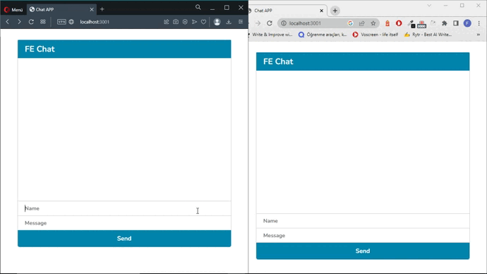
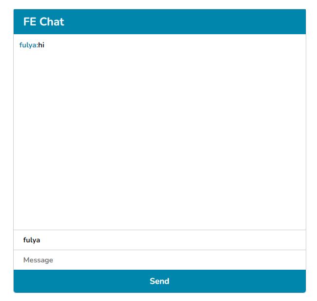
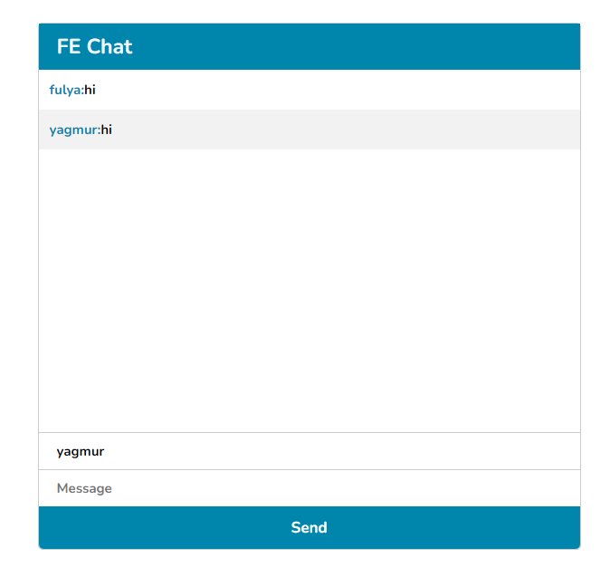

## Project: Real Time Chat App


## Animation of the App



## Visulation of Chat Screen for User 1



## Visulation of Chat Screen for User 2




## Description
Chat App provides a connection between different users that they connect on different browsers so they can send messages to each other on client side.


## Overview
I mastered HTML, CSS, JavaScript, NodeJS, ExpressJS in this project. You can see the visual representation of the app above.
## 🛠 Use To Built

<p align="left"> 


</p>

## 💻 Features

- User can send any message
- User can see who is writing message
- Fully Responsive
- Cross Platform
## 🔋 Installation

**1. Clone the Repository**

```
  git clone https://github.com/fulyaertay/nodejs-chat-app
```

**2. Move into the working directory**

```
  cd nodejs-chat-app
```

**3. Install Dependencies**

```
  npm init -y
  npm i express socket.io
```


**4. Run the App**

```
   nodemon server.js
```
